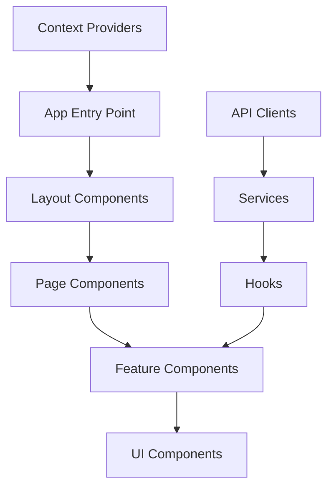
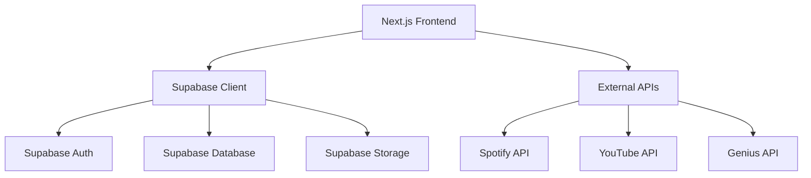
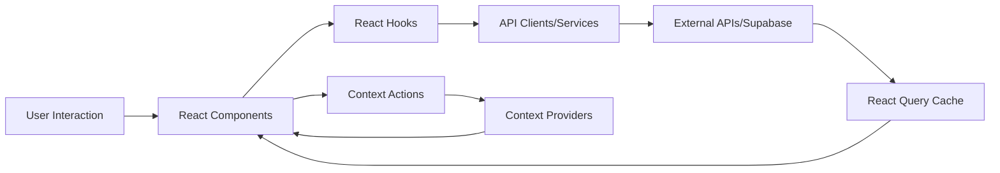

# Design Document

## Overview

OlamideVerse is a web-based platform dedicated to celebrating and preserving Olamide's musical legacy. The platform combines a comprehensive music library with immersive storytelling and interactive features to create a unique fan experience. It offers an immersive, interactive experience for fans by combining Olamide's complete discography with innovative tech like Three.js and GSAP to create dynamic, engaging user interfaces. This document outlines the technical design and architecture of the OlamideVerse platform.

## Architecture

### Frontend Architecture

OlamideVerse uses a modern frontend architecture based on Next.js with the App Router pattern. The application follows a component-based architecture with clear separation of concerns:



### Backend Architecture

The platform uses Supabase as a backend service for data storage, authentication, and file storage. The architecture is designed to be serverless, with most business logic implemented in the frontend application and Supabase edge functions when necessary.



### Data Flow

The data flow in OlamideVerse follows a unidirectional pattern, with React Query managing server state and React Context managing client state:



## Components and Interfaces

### Core Components

1. **Layout Components**
   - `MainLayout`: The main layout wrapper for the application
   - `Header`: Navigation and branding
   - `Footer`: Credits and legal information
   - `LegalDisclaimer`: Legal notices for content usage

2. **Album Components**
   - `AlbumGrid`: Responsive grid display of albums with filtering and sorting
   - `AlbumCard`: Individual album display with Atropos.js for parallax hover effects
   - `AlbumDetail`: Detailed view of an album with track listing
   - `TrackList`: List of tracks with playback controls
   - `AlbumVisual`: Three.js-based rotating disc animations

3. **Player Components**
   - `MusicPlayer`: Core player component with controls using howler.js
   - `ProgressBar`: Track progress visualization with timeline scrubbing
   - `VolumeControl`: Volume adjustment interface
   - `LyricsDisplay`: Synchronized lyrics display with anime.js highlighting
   - `WaveformVisualizer`: Sound-reactive waveform visualization using Konva.js
   - `ThreeJsVisualizer`: 3D visualization component for album discs

4. **Story Components**
   - `StoryContainer`: Main container for story mode
   - `StoryNavigation`: Chapter and section navigation
   - `StoryContent`: MDX-based content renderer using Notion API or MDX
   - `MediaGallery`: Rich media display for story content with Keen-Slider
   - `InteractiveElement`: Interactive story elements using Konva.js
   - `StoryTransition`: Animated transitions between story elements with GSAP
   - `FlowchartElement`: Visual storytelling elements using Flowchart Fun

5. **User Components**
   - `AuthForms`: Login and registration forms with social authentication options
   - `UserProfile`: User profile display and editing
   - `PlaylistManager`: Playlist creation, editing, and sharing
   - `SocialSharing`: Content sharing functionality
   - `AudiogramGenerator`: Shareable audio snippet creation using Remotion
   - `CommunityPolls`: Interactive polls for voting on tracks, albums, and bars
   - `CommentSystem`: User comments and discussions

### Key Interfaces

```typescript
// Core data models
interface Album {
  id: string;
  title: string;
  releaseDate: string;
  coverArt: string;
  description: string;
  tracks: Track[];
  metadata: AlbumMetadata;
}

interface Track {
  id: string;
  title: string;
  duration: number;
  audioUrl: string;
  lyrics?: Lyrics;
  features?: Artist[];
  metadata: TrackMetadata;
}

interface Artist {
  id: string;
  name: string;
  imageUrl?: string;
  bio?: string;
}

interface Lyrics {
  text: string;
  synced: LyricLine[];
}

interface LyricLine {
  text: string;
  startTime: number;
  endTime: number;
}

interface User {
  id: string;
  username: string;
  email: string;
  preferences: UserPreferences;
  playlists: Playlist[];
}

interface Playlist {
  id: string;
  name: string;
  tracks: Track[];
  isPublic: boolean;
  createdAt: string;
  updatedAt: string;
}

interface StoryChapter {
  id: string;
  title: string;
  content: string; // MDX content
  media: MediaElement[];
  relatedAlbum?: Album;
}

interface MediaElement {
  id: string;
  type: 'image' | 'video' | 'audio' | 'embed';
  url: string;
  caption?: string;
  metadata: Record<string, any>;
}
```

## Data Models

### Database Schema

The Supabase database schema includes the following tables:

1. **albums**
   - id (primary key)
   - title
   - release_date
   - cover_art_url
   - description
   - metadata (JSONB)
   - created_at
   - updated_at

2. **tracks**
   - id (primary key)
   - album_id (foreign key)
   - title
   - duration
   - audio_url
   - lyrics_id (foreign key, nullable)
   - position
   - metadata (JSONB)
   - created_at
   - updated_at

3. **lyrics**
   - id (primary key)
   - track_id (foreign key)
   - text
   - synced_lyrics (JSONB)
   - source
   - created_at
   - updated_at

4. **artists**
   - id (primary key)
   - name
   - image_url
   - bio
   - created_at
   - updated_at

5. **track_artists** (junction table)
   - track_id (foreign key)
   - artist_id (foreign key)
   - role (e.g., 'primary', 'feature')

6. **users** (managed by Supabase Auth)
   - id (primary key)
   - email
   - username
   - created_at
   - updated_at

7. **user_preferences**
   - user_id (foreign key)
   - theme
   - language
   - playback_quality
   - notifications_enabled
   - created_at
   - updated_at

8. **playlists**
   - id (primary key)
   - user_id (foreign key)
   - name
   - description
   - is_public
   - created_at
   - updated_at

9. **playlist_tracks** (junction table)
   - playlist_id (foreign key)
   - track_id (foreign key)
   - position

10. **story_chapters**
    - id (primary key)
    - title
    - content
    - related_album_id (foreign key, nullable)
    - position
    - created_at
    - updated_at

11. **media**
    - id (primary key)
    - type
    - url
    - caption
    - metadata (JSONB)
    - created_at
    - updated_at

12. **chapter_media** (junction table)
    - chapter_id (foreign key)
    - media_id (foreign key)
    - position

### External API Integration

The platform integrates with several external APIs:

1. **Spotify API**
   - Authentication: OAuth 2.0
   - Endpoints: Albums, Tracks, Artists, Search
   - Rate limiting: 429 responses handled with exponential backoff

2. **YouTube API**
   - Authentication: API Key
   - Endpoints: Videos, Playlists, Search
   - Quota management: Caching to minimize API calls

3. **Genius API**
   - Authentication: API Key
   - Endpoints: Songs, Search, Lyrics
   - Rate limiting: Handled with request throttling

## Error Handling

### Frontend Error Handling

1. **API Error Handling**
   - React Query error handling for API requests
   - Retry logic for transient errors
   - User-friendly error messages
   - Fallback UI components for error states

2. **Form Validation**
   - Client-side validation using Zod
   - Server-side validation in Supabase functions
   - Detailed error messages for form fields

3. **Authentication Errors**
   - Session expiration handling
   - Authentication state recovery
   - Graceful redirection to login

### Backend Error Handling

1. **Supabase Error Handling**
   - Database constraint violations
   - Authentication failures
   - Storage errors

2. **External API Errors**
   - API-specific error codes
   - Fallback content when APIs are unavailable
   - Caching to provide offline functionality

## Testing Strategy

### Unit Testing

- Jest for JavaScript/TypeScript testing
- React Testing Library for component testing
- Mock service worker for API mocking
- Test coverage targets: 80% for core functionality
- Husky for pre-commit validation

### Integration Testing

- End-to-end testing with Playwright
- Critical user flows:
  - Album browsing and playback
  - Story mode navigation
  - User authentication
  - Playlist management

### Performance Testing

- Lighthouse CI for performance metrics and auditing
- Core Web Vitals monitoring
- Bundle size analysis with webpack-bundle-analyzer
- Performance budgets for key metrics
- Turbopack (Next.js integrated) for build optimization

### Accessibility Testing

- Automated accessibility testing with axe
- Manual testing with screen readers
- Keyboard navigation testing
- Color contrast verification

## Security Considerations

1. **Authentication**
   - Secure session management with Supabase Auth
   - PKCE flow for OAuth providers
   - Proper token storage and refresh

2. **Data Protection**
   - Row-level security in Supabase
   - Input validation and sanitization
   - Content Security Policy implementation

3. **API Security**
   - API key protection
   - Rate limiting
   - CORS configuration

## Deployment and DevOps

1. **CI/CD Pipeline**
   - GitHub Actions for continuous integration
   - Automated testing on pull requests
   - Deployment to Vercel

2. **Environments**
   - Development
   - Staging
   - Production

3. **Monitoring**
   - Error tracking with Sentry
   - Performance monitoring with Vercel Analytics
   - Custom in-house analytics implementation for privacy-focused usage tracking
   - Checkmate for server monitoring

## Future Considerations

1. **Internationalization**
   - Multi-language support
   - Cultural adaptations

2. **Monetization**
   - Fan memberships (premium features)
   - Merch drops (album-era themed)
   - Concert archives (exclusive legacy content)
   - Ad/sponsor spots (for artists/brands)
   - Tour/event portal (ticketing & promotions)

3. **Mobile Applications**
   - React Native implementation
   - Progressive Web App enhancements

4. **Bonus Features**
   - AI-generated artist influence graph
   - "Olamide Impact Map"
   - Real-time fan chat under tracks
   - Highcharts/D3.js for visualizing career stats and streaming growth
